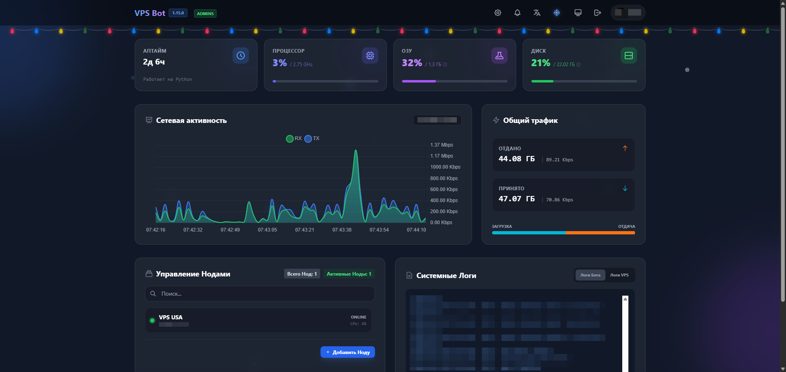
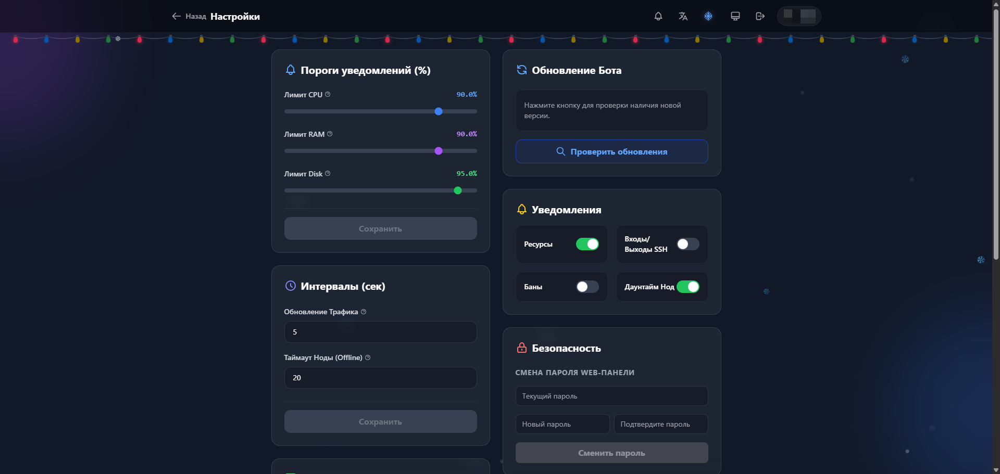
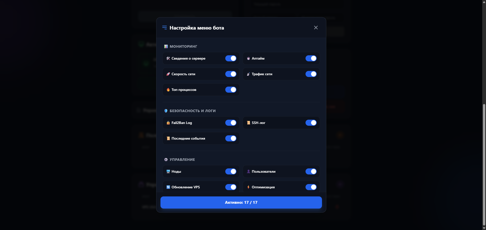
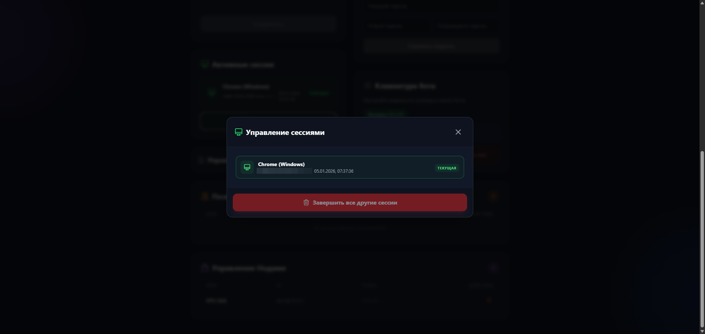
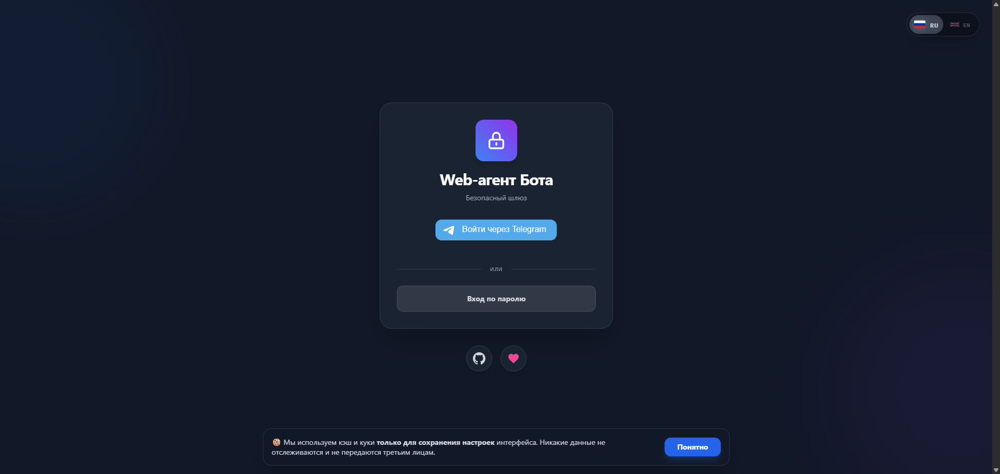
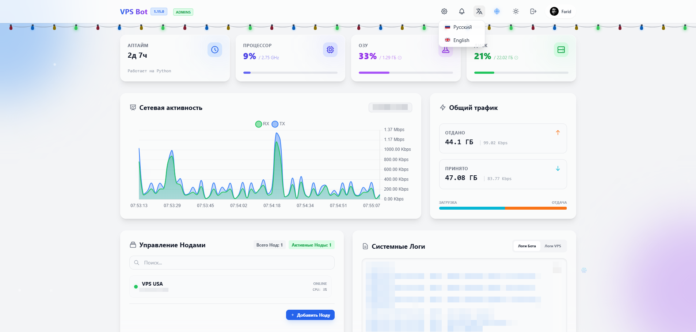

<p align="center">
  <a href="README.en.md">English Version</a> | Русская Версия
</p>

<h1 align="center">🤖 VPS Manager Telegram Bot</h1>

<p align="center"> <b>v1.16.0</b> — профессиональная экосистема для мониторинга и управления вашей <b>сетью серверов</b>. 
Система построена на <b>асинхронном ядре</b> (AsyncIO), базе данных <b>SQLite</b> и полностью интегрирована с <b>Docker</b>. 
Включает современный <b>веб-интерфейс</b> на базе технологии <b>SSE</b> для мгновенного мониторинга и управления нодами. </p>

<p align="center">
  <a href="https://github.com/jatixs/tgbotvpscp/releases/latest"></a>
  <a href="CHANGELOG.md"></a>
  <a href="https://www.python.org/"></a>
  <a href="https://choosealicense.com/licenses/gpl-3.0/"></a>
  <a href="https://github.com/aiogram/aiogram"></a>
  <a href="https://www.docker.com/"></a>
  <a href="https://releases.ubuntu.com/focal/"></a>
  <a href="https://github.com/jatixs/tgbotvpscp/actions/workflows/security.yml/"></a>
</p>

---

## 📘 Оглавление
1. [Описание проекта](#-описание-проекта)
2. [Ключевые функции](#-ключевые-функции)
3. [Галерея](#-галерея)
4. [Развертывание (Быстрый старт)](#-развертывание-на-vps-быстрый-старт)
   - [Подготовка](#1-подготовка)
   - [Установка Основного Бота (Master)](#2-установка-основного-бота-master)
   - [Подключение Нод (Клиентов)](#3-подключение-нод-клиентов)
   - [Полезные команды](#-полезные-команды)
4. [Структура проекта](#️-структура-проекта)
5. [Безопасность](#-безопасность)
6. [Документация](#-документация)
7. [Автор](#-автор)

---

## 🧩 Описание проекта

**VPS Manager Telegram Bot** — это комплексное решение для администрирования серверов через Telegram. Бот эволюционировал в профессиональную систему управления инфраструктурой: отслеживайте состояние основного сервера (**Agent**) и сети удаленных узлов (**Nodes**) в реальном времени.

Проект модульный и работает в двух режимах:
1.  **Agent (Бот):** Управляющий центр с Telegram-интерфейсом, асинхронным API, базой данных SQLite и Web-админкой.
2.  **Node (Агент):** Легковесный клиент (`tg-node`) для удаленных VPS. Передает телеметрию и выполняет команды.

---

## ⚡ Ключевые функции

### 🚀 Производительность и Надежность
* **Асинхронное ядро:** Полный переход на `aiohttp` и `aiosqlite`. Никаких блокировок при сетевых запросах или записи данных.
* **База данных SQLite:** Надежное хранение конфигурации нод, задач и истории метрик. Автоматическая миграция данных из JSON.
* **Безопасность:** Защита от Shell Injection (`shlex`), серверные сессии, Rate Limiter и экранирование XSS.

### 🖥 Мульти-серверность (Ноды)
* **Единый центр:** Управление неограниченным числом серверов.
* **Мониторинг:** Статус (Online/Offline), пинг, аптайм и ресурсы всех нод.
* **Удаленное управление:** `Reboot`, `Speedtest`, `Traffic`, `Top` на любом сервере.
* **Web Status Page:** HTML-дашборд (`http://IP:8080`) с мониторингом в реальном времени.

### 🛠 Основной функционал
* 🐳 **Полная поддержка Docker:** Установка в один клик (`secure` и `root` режимы).
* 🌐 **Многоязычность (i18n):** Русский и Английский языки.
* 💻 **Мониторинг ресурсов:** CPU, RAM, Disk, Uptime (корректная работа в Docker-root).
* 📡 **Сетевая статистика:** Трафик и скорость (iperf3) в реальном времени.
* 🔔 **Умные уведомления:** Алерты о ресурсах, SSH-входах, банах Fail2Ban и **даунтайме нод**.
* ✨ **Smart Installer (`deploy.sh`):** Интерактивное меню для установки/обновления Бота и Нод.
* 🚀 **Диагностика:** Пинг, Speedtest, Топ процессов.
* 🛡️ **Безопасность:** Логи SSH и Fail2Ban.
* 🔑 **VLESS & Xray:** Генерация ссылок, QR-кодов и обновление ядер (Marzban/Amnezia).

---
## 📸 Галерея

<details>
  <summary><b>📱 Telegram Bot (Нажмите для просмотра)</b></summary>

  | Главное меню | Статистика | Настройки |
  |:---:|:---:|:---:|
  |  |  |  |
  | **Мониторинг** | **Утилиты** | **Ноды** |
  |  |  |  |

</details>

<details>
  <summary><b>💻 Web Dashboard (Нажмите для просмотра)</b></summary>

  | Дашборд | Мониторинг |
  |:---:|:---:|
  |  |  |
  | **Графики** | **Логи** |
  |  |  |
  | **Настройки** | **Безопасность** |
  |  |  |

  <p align="center">
    <b>📱 Светлая тема / Языки</b><br>
    
  </p>

</details>

---

## 🚀 Развертывание на VPS (Быстрый старт)

Требуется **Ubuntu 20.04+** (или аналог) и `sudo` доступ.

### 1. Подготовка

1.  Получите токен в **[@BotFather](https://t.me/BotFather)**.
2.  Узнайте свой **User ID** (например, через [@userinfobot](https://t.me/userinfobot)).
3.  Убедитесь, что установлены `curl` и `git`.

---

### 2. Установка Основного Бота (Master)

На сервере управления выполните:

```bash
bash <(wget -qO- https://raw.githubusercontent.com/jatixs/tgbotvpscp/main/deploy.sh)
````

1.  Выберите режим установки (рекомендуем **Docker - Secure**).
2.  Введите **Токен** и **ID админа**.
3.  Бот запустится и откроет API-сервер на порту `8080`.

-----

### 3. Подключение Нод (Клиентов)

Для подключения удаленного сервера:

1.  **В Telegram-боте:**
      * Меню **🖥 Ноды** -> **➕ Добавить Ноду**.
      * Введите имя. Бот выдаст **Токен**.
2.  **На удаленном сервере:**
      * Запустите тот же скрипт установки:
        ```bash
        bash <(wget -qO- https://raw.githubusercontent.com/jatixs/tgbotvpscp/main/deploy.sh)
        ```
      * Выберите **8) Установить НОДУ (Клиент)**.
      * Введите:
          * **URL Агента:** Адрес основного бота (напр. `http://1.2.3.4:8080`).
          * **Токен:** Полученный в боте.

Агент установится как сервис `tg-node` и появится в боте.

-----

### 🧰 Полезные команды

#### 🕹 Управление процессами

| Действие | Systemd (Обычный) | Docker (Контейнеры) |
| :--- | :--- | :--- |
| **Статус Бота** | `sudo systemctl status tg-bot` | `docker compose -f /opt/tg-bot/docker-compose.yml ps` |
| **Статус Watchdog** | `sudo systemctl status tg-watchdog` | *Запущен в контейнере watchdog* |
| **Перезапуск Бота** | `sudo systemctl restart tg-bot` | `docker compose -f /opt/tg-bot/docker-compose.yml restart bot-secure` (или `bot-root`) |
| **Остановка** | `sudo systemctl stop tg-bot` | `docker compose -f /opt/tg-bot/docker-compose.yml stop` |
| **Запуск** | `sudo systemctl start tg-bot` | `docker compose -f /opt/tg-bot/docker-compose.yml up -d` |

#### 📜 Логи и Отладка

| Действие | Systemd | Docker |
| :--- | :--- | :--- |
| **Логи Бота (Live)** | `sudo journalctl -u tg-bot -f` | `docker compose -f /opt/tg-bot/docker-compose.yml logs -f bot-secure` |
| **Логи Watchdog** | `sudo journalctl -u tg-watchdog -f` | `docker compose -f /opt/tg-bot/docker-compose.yml logs -f watchdog` |
| **Ошибки (grep)** | `grep "ERROR" /opt/tg-bot/logs/bot/bot.log` | *Аналогично (файлы логов проброшены на хост)* |

#### 💾 База данных и Обслуживание

| Действие | Команда (Выполнять в `/opt/tg-bot/`) |
| :--- | :--- |
| **Бэкап БД** | `cp config/nodes.db config/nodes.db.bak_$(date +%F)` |
| **Ручное обновление** | `git pull && source venv/bin/activate && pip install -r requirements.txt && sudo systemctl restart tg-bot` |
| **Сброс пароля Web** | *Удалите строку `password_hash` у админа в `config/users.json` и перезапустите бота* |

#### 🖥 Для Ноды (Клиента)

| Действие | Команда |
| :--- | :--- |
| **Перезапуск** | `sudo systemctl restart tg-node` |
| **Просмотр лога** | `sudo journalctl -u tg-node -f` |
| **Проверка конфига** | `cat /opt/tg-bot/.env` |

*(Для Docker Secure используйте `bot-secure` вместо `bot-root`)*

-----

## ⚙️ Структура проекта

```
/opt/tg-bot/
├── .github/
│   └── workflows/
│       ├── codeql.yml
│       ├── gitleaks.yml
│       ├── python-safety.yml
│       ├── security.yml
│       └── trivy.yml
├── assets/                  # Изображения (для README)
│   ├── bot_1.png ...
│   └── web_1.png ...
├── core/                    # Ядро бота
│   ├── static/              # Статика для Web-панели
│   │   ├── css/
│   │   │   ├── login.css
│   │   │   └── style.css
│   │   └── js/
│   │       ├── common.js
│   │       ├── dashboard.js
│   │       ├── login.js
│   │       ├── settings.js
│   │       └── theme_init.js
│   ├── templates/           # HTML-шаблоны
│   │   ├── dashboard.html
│   │   ├── login.html
│   │   ├── reset_password.html
│   │   └── settings.html
│   ├── auth.py              # Авторизация и права
│   ├── config.py            # Конфигурация (.env)
│   ├── i18n.py              # Мультиязычность (RU/EN)
│   ├── keyboards.py         # Клавиатуры (Inline/Reply)
│   ├── messaging.py         # Управление сообщениями
│   ├── middlewares.py       # Анти-спам (Middleware)
│   ├── models.py            # Модели БД (Tortoise ORM)
│   ├── nodes_db.py          # БД для Нод (SQLite)
│   ├── server.py            # Веб-сервер (Aiohttp)
│   ├── shared_state.py      # Состояние (кэши)
│   └── utils.py             # Утилиты
├── modules/                 # Модули команд
│   ├── fail2ban.py
│   ├── logs.py
│   ├── nodes.py             # Управление нодами
│   ├── notifications.py     # Алерты и мониторинг
│   ├── optimize.py
│   ├── reboot.py
│   ├── restart.py
│   ├── selftest.py
│   ├── speedtest.py
│   ├── sshlog.py
│   ├── top.py
│   ├── traffic.py
│   ├── update.py
│   ├── uptime.py
│   ├── users.py
│   ├── vless.py
│   └── xray.py
├── node/                    # Агент для удаленных серверов
│   └── node.py
├── .env.example             # Пример конфига
├── .gitignore
├── aerich.ini               # Конфиг миграций
├── bot.py                   # Главный файл запуска
├── CHANGELOG.md             # История изменений (RU)
├── CHANGELOG.en.md          # История изменений (EN)
├── custom_module.md         # Инструкция: Свой модуль (RU)
├── custom_module_en.md      # Инструкция: Свой модуль (EN)
├── deploy.sh                # Установщик (RU)
├── deploy_en.sh             # Установщик (EN)
├── docker-compose.yml       # Docker конфиг
├── Dockerfile
├── LICENSE
├── migrate.py               # Скрипт миграций
├── README.md                # Описание (RU)
├── README.en.md             # Описание (EN)
├── requirements.txt         # Зависимости
└── watchdog.py              # Watchdog (перезапуск)
```

-----

## 🔒 Безопасность

  * **Изоляция:** Secure-режим запускает бота от пользователя `tgbot`.
  * **Защита данных:** SQLite база данных, серверные сессии, Rate Limiter.
  * **Защита от инъекций:** Использование `shlex` для экранирования команд.
  * **Токены:** Уникальные токены авторизации для каждой ноды.

-----
## 📚 Документация

* 📖 **[Архитектура и полное описание функций](ARCHITECTURE.md)** — узнайте, как устроен бот и за что отвечает каждый файл.
* 🧩 **[Создание своего модуля](custom_module.md)** — инструкция по добавлению новых кнопок и функций.

-----
## 👤 Автор

**Версия:** 1.16.0 (Build 59) <br>
**Автор:** Jatix <br>
📜 **Лицензия:** GPL-3.0 <br>
